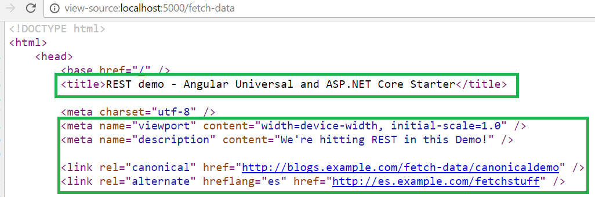

# ASP.NET Core 2.0 & Angular 4 (+) advanced starter - with Server-side prerendering (for Angular SEO)!

> [(upcoming) Angular 5.0 demo Branch Here](https://github.com/MarkPieszak/aspnetcore-angular2-universal/tree/angular-5.0-WIP)

<p align="center">
    
</p>

### Harness the power of Angular 4+, ASP.NET Core 2.0, now with SEO !

Angular SEO in action:

<p align="center">
  
</p>

### What is this repo? Live Demo here: http://aspnetcore-angular2-universal.azurewebsites.net

This repository is maintained by [Angular](https://github.com/angular/angular) and is meant to be an advanced starter 
for both ASP.NET Core 2.0 using Angular 4.0+, not only for the client-side, but to be rendered on the server for instant 
application paints (Note: If you don't need SSR [read here](#faq) on how to disable it).

This is meant to be a Feature-Rich Starter application containing all of the latest technologies, best build systems available, and include many real-world examples and libraries needed in todays Single Page Applications (SPAs).

This utilizes all the latest standards, no gulp, no bower, no typings, no manually "building" anything. NPM, Webpack and .NET handle everything for you!

# Table of Contents

* [Features](#features)
* [Getting Started](#getting-started)
* [Deployment](#deployment)
* [Upcoming Features](#upcoming-features)
* [Application Structure](#application-structure)
* [Gotchas](#gotchas)
* [FAQ](#faq---also-check-out-the-faq-issues-label)
* [Special Thanks](#special-thanks)
* [License](#license)
* [Consulting & Training](#looking-for-angular--aspnet-consulting--training--support)

---

# Features:

> These are just some of the features found in this starter!

- ASP.NET 2.0 - VS2017 15.3 support now!
  - Azure delpoyment straight from VS2017
  - Built in docker support through VS2017
  - RestAPI (WebAPI) integration
  - SQL Database CRUD demo
  - Swagger WebAPI documentation when running in development mode 
  - SignalR Chat demo! (Thanks to [@hakonamatata](https://github.com/hakonamatata))

- **Angular 4.0.0** :
  - (Minimal) Angular-CLI integration 
    - This is to be used mainly for Generating Components/Services/etc.
    - Usage examples: 
      - `ng g c components/example-component`
      - `ng g s shared/some-service`
  - Featuring Server-side rendering (Platform-Server, aka: "Universal")
	  - Faster initial paints, SEO (Search-engine optimization w Title/Meta/Link tags), social media link-previews, etc
  - i18n internationalization support (via/ ngx-translate)
  - Baked in best-practices (follows Angular style guide)
  - Bootstrap3 (with ngx-bootstrap) - (can be rendered on the server!)
    - Can be easily replaced with bootstrap4 (3 is provided for browser support)
    - Bootstrap using SCSS / SASS for easy theming / styling!

- **Webpack build system (Webpack 2)**
  - HMR : Hot Module Reloading/Replacement 
  - Production builds w/ AoT Compilation

- **Testing frameworks**
  - Unit testing with Jest (Going back to Karma soon)

- **Productivity**
  - Typescript 2
  - Codelyzer (for Real-time static code analysis) 
    - VSCode & Atom provide real-time analysis out of the box.

- **ASP.NET Core 2.0**
  
  - Integration with NodeJS to provide pre-rendering, as well as any other Node module asset you want to use.

- **Azure**
  - Microsoft Application Insights setup (for MVC & Web API routing)
  - Client-side Angular2 Application Insights integration
    - If you're using Azure simply install `npm i -S @markpieszak/ng-application-insights` as a dependencies.
    - Note: Make sure only the Browser makes these calls ([usage info here](https://github.com/MarkPieszak/angular-application-insights/blob/master/README.md#usage))
    - More information here: - https://github.com/MarkPieszak/angular-application-insights
    ```typescript
      // Add the Module to your imports 
      ApplicationInsightsModule.forRoot({
        instrumentationKey: 'Your-Application-Insights-instrumentationKey'
      })
    ```
  

> Looking for the older 2.x branch? Go [here](https://github.com/MarkPieszak/aspnetcore-angular2-universal/tree/old-2.x-universal-branch)

----

----
  
# Getting Started?

- **Make sure you have at least Node 6.x or higher (w/ npm 3+) installed!**  
- **This repository uses ASP.Net Core 2.0, which has a hard requirement on .NET Core Runtime 2.0.0 and .NET Core SDK 2.0.0. Please install these items from [here](https://github.com/dotnet/core/blob/master/release-notes/download-archives/2.0.0-download.md)**


### Visual Studio 2017

Make sure you have .NET Core 2.0 installed and/or VS2017 15.3.
VS2017 will automatically install all the neccessary npm & .NET dependencies when you open the project.

Simply push F5 to start debugging !

**Note**: If you get any errors after this such as `module not found: boot.server` (or similar), open up command line and run `npm run build:dev` to make sure all the assets have been properly built by Webpack.

### Visual Studio Code

> Note: Make sure you have the C# extension & .NET Core Debugger installed.

The project comes with the configured Launch.json files to let you just push F5 to start the project.

```bash
# cd into the directory you cloned the project into
npm install && npm run build:dev && dotnet restore
# or yarn install
```

If you're running the project from command line with `dotnet run` make sure you set your environment variables to Development (otherwise things like HMR might not work).

```bash
# on Windows:
set ASPNETCORE_ENVIRONMENT=Development
# on Mac/Linux
export ASPNETCORE_ENVIRONMENT=Development 
```

# Upcoming Features:

- Update to use npm [ngAspnetCoreEngine](https://github.com/angular/universal/pull/682) (still need to tweak a few things there)
- Potractor e2e testing
- Add basic Redux State store (Will also hold state durijg HMR builds)

----

----

# Deployment

### Dotnet publish
Using `dotnet publish`, when it's finished place the generated folder onto your server and use IIS to fire everything up.

### Heroku 
<a href="https://dashboard.heroku.com/new?template=https://github.com/MarkPieszak/aspnetcore-angular2-universal.git">

</a>

### Azure

```bash
git remote add azure https://your-user-name@my-angular2-site.scm.azurewebsites.net:443/my-angular2-site.git
                     // ^ get this from Azure (Web App Overview section - Git clone url)

git push --set-upstream azure master 
```

# Application Structure:

> Note: This application has WebAPI (our REST API) setup inside the same project, but of course all of this 
could be abstracted out into a completely separate project('s) ideally. .NET Core things are all done in the same project 
for simplicity's sake.

**Root level files** 

Here we have the *usual suspects* found at the root level.

*Front-end oriented files:*

- `package.json` - NPM project dependencies & scripts
- `.tsconfig` - TypeScript configuration (here we setup PATHs as well)
- `webpack` - configuration files (modular bundling + so much more)
- `karma` - configuration files (unit testing)
- `protractor` - config files (e2e testing)
- `tslint` - TypeScript code linting rules

### /ClientApp/ - Everything Angular 

> Let's take a look at how this is structured so we can make some sense of it all!

With Angular Universal, we need to split our applicatoin logic **per platform** so [if we look inside this folder](./ClientApp), 
you'll see the 2 root files, that branch the entire logic for browser & server respectively.

- [**Boot.Browser.ts**](./ClientApp/boot.browser.ts) - 
This file starts up the entire Angular application for the Client/browser platform. 

Here we setup a few things, client Angular bootstrapping.

You'll barely need to touch this file, but something to note, this is the file where you would import libraries that you **only** want 
being used in the Browser. (Just know that you'd have to provide a mock implementation for the Server when doing that).

- [**Boot.Server.ts**](./ClientApp/boot.server.ts) - 
This file is where Angular _platform-server_ *serializes* the Angular application itself on the .NET server 
within a very quick Node process, and renders it a string. This is what causes that initial fast paint 
of the entire application to the Browser, and helps us get all our _SEO_ goodness :sparkles:

---

Notice the folder structure here in `./ClientApp/` :

```diff
+ /ClientApp/

+   /app/
    App NgModule - our Root NgModule (you'll insert Components/etc here most often)
    AppComponent / App Routes / global css styles

    * Notice that we have 2 dividing NgModules:
        app.module.browser & app.module.server
    You'll almost always be using the common app.module, but these 2 are used to split up platform logic
    for situations where you need to use Dependency Injection / etc, between platforms.

Note: You could use whatever folder conventions you'd like, I prefer to split up things in terms of whether they are re-usable 
     "components" or routeable / page-like components that group together and organize entire sections.
++ > ++ > /components/ 
          Here are all the regular Components that aren't "Pages" or container Components

++ > ++ > /containers/
          These are the routeable or "Page / Container" Components, sometimes known as "Dumb" Components

++ > ++ > /shared/
          Here we put all shared Services / Directives / Pipes etc
```

When adding new features/components/etc to your application you'll be commonly adding things to the Root **NgModule** (located 
in `/ClientApp/app/app.module.ts`), but why are there **two** other NgModules in this folder?

This is because we want to split our logic **per Platform**, but notice they both share the Common NgModule 
named `app.module.ts`. When adding most things to your application, this is the only 
place you'll have to add in your new Component / Directive / Pipe / etc.  You'll only occassional need to manually 
add in the Platform specific things to either `app.module.browser || app.module.server`.

To illustrate this point with an example, you can see how we're using Dependency Injection to inject a `StorageService` that is different 
for the Browser & Server.

```typescript
// For the Browser (app.module.browser)
{ provide: StorageService, useClass: BrowserStorage }

// For the Server (app.module.server)
{ provide: StorageService, useClass: ServerStorage }
```

> Just remember, you'll usually only need to worry about `app.module.ts`, as that's where you'll be adding most 
of your applications new aspects!


### /Server/ - Our REST API (WebApi) - MVC Controller

> As we pointed out, these are here for simplicities sake, and realistically you may want separate projects 
for all your microservices / REST API projects / etc.

We're utilizing MVC within this application, but we only need & have ONE Controller, named `HomeController`. This is where our entire 
Angular application gets serialized into a String, sent to the Browser, along with all the assets it needs to then bootstrap on the client-side, and become a full-blown SPA afterwards.

---

The short-version is that we invoke that Node process, passing in our Request object & invoke the `boot.server` file, and we get back a nice object that we pass into .NETs `ViewData` object, and sprinkle through out our `Views/Shared/_Layout.cshtml` and `/Views/Home/index.cshtml` files!

A more detailed explanation can be found here: [ng-AspnetCore-Engine Readme](https://github.com/angular/universal/tree/master/modules/ng-aspnetcore-engine)

```csharp
// Prerender / Serialize application
var prerenderResult = await Prerenderer.RenderToString(
    /* all of our parameters / options / boot.server file / customData object goes here */
);

ViewData["SpaHtml"] = prerenderResult.Html;
ViewData["Title"] = prerenderResult.Globals["title"];
ViewData["Styles"] = prerenderResult.Globals["styles"];
ViewData["Meta"] = prerenderResult.Globals["meta"];
ViewData["Links"] = prerenderResult.Globals["links"];

return View(); // let's render the MVC View
```

Take a look at the `_Layout.cshtml` file for example, notice how we let .NET handle and inject all our SEO magic (that we extracted from Angular itself) !

```html
<!DOCTYPE html>
<html>
    <head>
        <base href="/" />
        <!-- Title will be the one you set in your Angular application -->
        <title>@ViewData["Title"] - AspNET.Core Angular 4.0.0 (+) starter</title>

        <meta charset="utf-8" />
        <meta name="viewport" content="width=device-width, initial-scale=1.0" />
        @Html.Raw(ViewData["Meta"]) <!-- <meta /> tags -->
        @Html.Raw(ViewData["Links"]) <!-- <link /> tags -->
        
        <link rel="stylesheet" href="~/dist/vendor.css" asp-append-version="true" />

        @Html.Raw(ViewData["Styles"]) <!-- <style /> tags -->

    </head>
    ... etc ...
```

Our `Views/Home/index.cshtml` simply renders the application and serves the bundled webpack files in it.

```html
@Html.Raw(ViewData["SpaHtml"])

<script src="~/dist/vendor.js" asp-append-version="true"></script>
@section scripts {
    <script src="~/dist/main-client.js" asp-append-version="true"></script>
}
```

### What happens after the App gets server rendered?

Well now, your Client-side Angular will take over, and you'll have a fully functioning SPA. (But we gained all these great SEO benefits of being server-rendered) !

:sparkles:


----

----

# "Gotchas"

- This repository uses ASP.Net Core 2.0, which has a hard requirement on .NET Core Runtime 2.0.0 and .NET Core SDK 2.0.0. Please install these items from [here](https://github.com/dotnet/core/blob/master/release-notes/download-archives/2.0.0-download.md)

> When building components in Angular 4 there are a few things to keep in mind.

 - **`window`**, **`document`**, **`navigator`**, and other browser types - _do not exist on the server_ - so using them, or any library that uses them (jQuery for example) will not work. You do have some options, if you truly need some of this functionality:
    - If you need to use them, consider limiting them to only your client and wrapping them situationally. You can use the Object injected using the PLATFORM_ID token to check whether the current platform is browser or server. 
    
    ```typescript
     import { PLATFORM_ID } from '@angular/core';
     import { isPlatformBrowser, isPlatformServer } from '@angular/common';
     
     constructor(@Inject(PLATFORM_ID) private platformId: Object) { ... }
     
     ngOnInit() {
       if (isPlatformBrowser(this.platformId)) {
          // Client only code.
          ...
       }
       if (isPlatformServer(this.platformId)) {
         // Server only code.
         ...
       }
     }
    ```
    
     - Try to *limit or* **avoid** using **`setTimeout`**. It will slow down the server-side rendering process. Make sure to remove them [`ngOnDestroy`](https://angular.io/docs/ts/latest/api/core/index/OnDestroy-class.html) in Components.
   - Also for RxJs timeouts, make sure to _cancel_ their stream on success, for they can slow down rendering as well.
 - **Don't manipulate the nativeElement directly**. Use the _Renderer2_. We do this to ensure that in any environment we're able to change our view.
```typescript
constructor(element: ElementRef, renderer: Renderer2) {
  this.renderer.setStyle(element.nativeElement, 'font-size', 'x-large');
}
```
 - The application runs XHR requests on the server & once again on the Client-side (when the application bootstraps)
    - Use a cache that's transferred from server to client (TODO: Point to the example)
 - Know the difference between attributes and properties in relation to the DOM.
 - Keep your directives stateless as much as possible. For stateful directives, you may need to provide an attribute that reflects the corresponding property with an initial string value such as url in img tag. For our native element the src attribute is reflected as the src property of the element type HTMLImageElement.

----

----
 
# FAQ - Also check out the [!FAQ Issues label!](https://github.com/MarkPieszak/aspnetcore-angular2-universal/issues?utf8=%E2%9C%93&q=is%3Aissue%20label%3Afaq) and the [!HOW-TO Issues Label!](https://github.com/MarkPieszak/aspnetcore-angular2-universal/issues?q=is%3Aissue+label%3A%22HOW+TO+-+Guide%22)

### How can I disable SSR (Server-side rendering)?

Simply comment out the logic within HomeController, and replace `@Html.Raw(ViewData["SpaHtml"])` with just your applications root 
AppComponent tag ("app" in our case): `<app></app>`.

> You could also remove any `isPlatformBrowser/etc` logic, and delete the boot.server, app.module.browser & app.module.server files, just make sure your `boot.browser` file points to `app.module`.

### How do I have code run only in the Browser?

Check the [Gotchas](#gotchas) on how to use `isPlatformBrowser()`.

### How do I Material2 with this repo?

~~You'll either want to remove SSR for now, or wait as support should be coming to handle platform-server rendering.~~
This is now possible, with the recently updated Angular Material changes. We do not have a tutorial available for this yet.

### How can I use jQuery and/or some jQuery plugins with this repo?

> Note: If at all possible, try to avoid using jQuery or libraries dependent on it, as there are 
better, more abstract ways of dealing with the DOM in Angular (4+) such as using the Renderer, etc.

Yes, of course but there are a few things you need to setup before doing this. First, make sure jQuery 
is included in webpack vendor file, and that you have a webpack Plugin setup for it. `new webpack.ProvidePlugin({ $: 'jquery', jQuery: 'jquery' })`

Now, make sure any "plugins" etc that you have, are only included in your `boot.browser.ts` file. (ie: `import 'slick-carousel';`) 
In a Component you want to use jQuery, make sure to import it near the top like so:

```typescript
import * as $ from 'jquery';
```

**Always make sure to wrap anything jQuery oriented in Angular's `isPlatformBrowser()` conditional!**

### How can I support IE9 through IE11?

To support IE9 through IE11 open the `polyfills.ts` file in the `polyfills` folder and uncomment out the 'import polyfills' as needed.

----

# Special Thanks

Many thanks go out to Steve Sanderson ([@SteveSandersonMS](https://github.com/SteveSandersonMS)) from Microsoft and his amazing work on JavaScriptServices and integrating the world of Node with ASP.NET Core.

Also thank you to the many Contributors !
- [@Isaac2004](https://github.com/Isaac2004)
- [@AbrarJahin](https://github.com/AbrarJahin)
- [@LiverpoolOwen](https://github.com/LiverpoolOwen)
- [@hakonamatata](https://github.com/hakonamatata)
- [@markwhitfeld](https://github.com/markwhitfeld)
- [@Ketrex](https://github.com/Ketrex)

----
 
# Found a Bug? Want to Contribute?

[Check out our easier issues here](https://github.com/MarkPieszak/aspnetcore-angular2-universal/issues?utf8=%E2%9C%93&q=is%3Aissue%20is%3Aopen%20label%3A%22PRs%20welcome!%22%20)

Nothing's ever perfect, but please let me know by creating an issue (make sure there isn't an existing one about it already), and we'll try and work out a fix for it! If you have any good ideas, or want to contribute, feel free to either make an Issue with the Proposal, or just make a PR from your Fork.

----

# License

[](/LICENSE) 

Copyright (c) 2016-2017 [Mark Pieszak](https://github.com/MarkPieszak)

----

# DevHelp.Online - Angular & ASP.NET - Consulting | Training | Development

Check out **[www.DevHelp.Online](http://DevHelp.Online)** for more info!

Contact us at <hello@devhelp.online>, and let's talk about your projects needs.

----

## Follow me online:

Twitter: [@MarkPieszak](http://twitter.com/MarkPieszak) | Medium: [@MarkPieszak](https://medium.com/@MarkPieszak)
