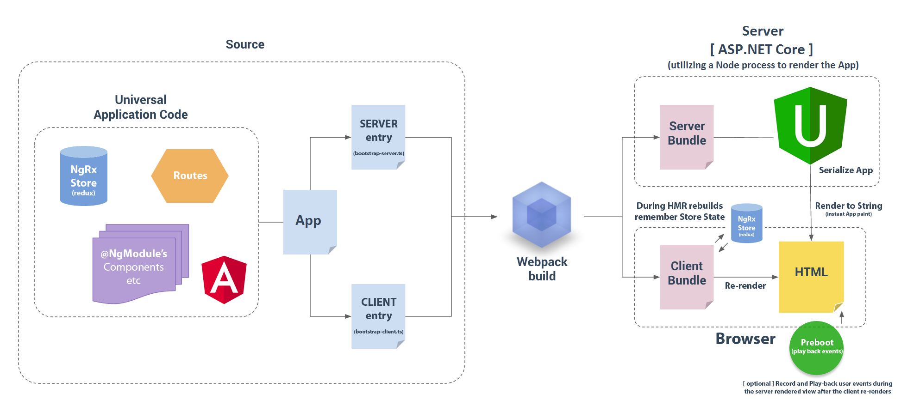

# ASP.NET Core & Angular 2+ Universal starter

<p align="center">
    
</p>

### What is this repo? Live Demo here: [http://aspnetcore-angular2-universal.azurewebsites.net](http://aspnetcore-angular2-universal.azurewebsites.net)**

This repository is maintained by [Angular Universal](https://github.com/angular/universal) and is meant to be an advanced starter for both ASP.NET Core using 
Angular 2.x(+), not only for the client-side, but to be rendered on the *server* for instant application paints 
(*Note*: If you don't need Universal (SSR) [read here](https://github.com/MarkPieszak/aspnetcore-angular2-universal#faq) on how to disable it). 

**How do I stay up-to-date with the latest updates & changes of the repo?** [Check out the CHANGELOG here](https://github.com/MarkPieszak/aspnetcore-angular2-universal/blob/master/CHANGELOG.md)

This is meant to be a Feature-Rich Starter application containing all of the latest technologies, best build systems available, and include many real-world examples and libraries needed in todays Single Page Applications (SPAs).

This utilizes all the latest standards, no gulp, no bower, no typings, no manually "building" anything. NPM, Webpack and .NET handle everything for you!

[1/23] Fully operational, some improvements & new functionality to come, keep an eye out for the latest updates!

> NOTE: Angular Universal is currently moving to Angular Core (https://github.com/angular/angular/issues/13822), we will need to wait for that and angular v4 to finish certain aspects (aot for example)

---

# Table of Contents

* [Features](#features)
* [Getting Started](#getting-started)
* [Deployment](#deployment)
* [Upcoming Features](#upcoming-features)
* [Application Structure](#application-structure)
* [Universal Gotchas](#universal-gotchas)
* [FAQ](#faq)
* [Special Thanks](#special-thanks)
* [License](#license)

---

# Features:

> These are just some of the features found in this starter!

- **Angular 2.x+** : (Currently working with latest Angular `2.4.7`)
  - Featuring Server-side rendering (Angular Universal)
	  - Faster paints, better SEO, deep-linking, etc
  - NgRx - Reactive Redux state management architecture
    - Built to work with the real-time Redux Devtools. [Get the Chrome extension here](https://github.com/zalmoxisus/redux-devtools-extension) 
  - Baked in best-practices (follows Angular style guide)
  - Bootstrap4 (with ng2-bootstrap) - can be rendered on the server

- **Webpack build system (Webpack 2)**
  - HMR : Hot Module Reloading/Replacement 
    - NgRx utilized and setup to **hold app State between HMR builds**
  - Production builds
  - Webpack Dashboard

- **Docker support**

- **Testing frameworks**
  - Unit testing with Karma/Jasmine
  - E2E testing with Protractor

- **Productivity**
  - Typescript 2
  - Codelyzer (for Real-Sime static code analysis) 
    - VSCode & Atom provide real-time analysis out of the box.
    - **NOTE**: Does not fully work with Visual Studio yet. (Even with 1.1.0-preview)

- **ASP.NET Core 1.1**
  - RestAPI integration
  - Integration with NodeJS to provide pre-rendering, as well as any other Node module asset you want to use.

- **Azure**
  - Microsoft Application Insights setup (for MVC & Web API routing)
  - (Client-side Angular2 Application Insights integration coming soon)

- **REST API CRUD demo with Entity Framework Core**
  - **[Postman](https://chrome.google.com/webstore/detail/postman/fhbjgbiflinjbdggehcddcbncdddomop) is used for testing the API**
  - [View examples here](./docs/RESTAPI-ENTITY.MD)

----

----
  
# Getting Started?

**Make sure you have at least Node 4.x or higher installed!**

**Development Mode** 

> You'll need ASP.NET Core installed (1.0.1 or 1.1). 
> Make sure you have VStudio 2015 update 3 installed as well.

 - Fork & Clone repo
 - Cmd-line run: `npm install && dotnet restore` (If using Visual Studio it will do both of these *automatically* when the project is opened)
 
 > Both Visual Studio & VSCode have the neccessary (Dev & Prod) Launch files to be able to run & debug immidiately.
 
If you're **not** using VSCode (which sets it to Development mode when you push F5), make sure you set the `ASPNETCORE_ENVIRONMENT` variable to `Development`: (VSCode does this through the launch.json file)
 
> Note: `set ASPNETCORE_ENVIRONMENT=Development` on Windows. `export ASPNETCORE_ENVIRONMENT=Development` on Mac/Linux.

--- 

**Production Mode**

Run `dotnet publish`, when it finishes, `cd` into the directory where it put everything, typically it's within `/bin/Debug/netcoreapp1.1/publish/`.

Now you can fire up the production applicatoin by running `dotnet aspnetcore-angular2-universal.dll` (If you renamed the project the part before `.dll` could be different, and your project name.

VSCode option 2: go to Command Line and set the environment variable 
to: `ASPNETCORE_ENVIRONMENT=Production`, then run `webpack` manually. Then you can launch the [Production] Launch Web option from VSCode.

> Note: `set ASPNETCORE_ENVIRONMENT=Production` on Windows. `export ASPNETCORE_ENVIRONMENT=Production` on Mac/Linux.

----

----

# Deployment

### Dotnet publish
Using `dotnet publish`, when it's finished place the generated folder onto your server and use IIS to fire everything up.

### Heroku 
<a href="https://dashboard.heroku.com/new?template=https://github.com/MarkPieszak/aspnetcore-angular2-universal.git">

</a>

### Azure

```bash
git remote add azure https://your-user-name@my-angular2-site.scm.azurewebsites.net:443/my-angular2-site.git
                     // ^ get this from Azure (Web App Overview section - Git clone url)

git push --set-upstream azure master 
```

----

----

# UPCOMING Features:

  - [ ] (On-hold) Example of NgRx (redux) transfering App State from server to client - track [#29](https://github.com/MarkPieszak/aspnetcore-angular2-universal/issues/29)
  - [ ] (On-hold) AoT (Ahead-of-time compilation) production builds - track [#10](https://github.com/MarkPieszak/aspnetcore-angular2-universal/issues/10)
  - [x] ~~SignalR (Websockets) example - track [#39](https://github.com/MarkPieszak/aspnetcore-angular2-universal/issues/39)~~
  - [x] ~~Automatically update Browser Title on Route change [#32](https://github.com/MarkPieszak/aspnetcore-angular2-universal/issues/32)~~
  - [x] ~~Update components real unit & e2e tests - track [#45](https://github.com/MarkPieszak/aspnetcore-angular2-universal/issues/45)~~
  - [x] ~~Storage Service (localStorage) showcasing Dependency Injection per-platform - [#35](https://github.com/MarkPieszak/aspnetcore-angular2-universal/issues/35)~~
  - [x] ~~NgRx (reactive Redux application state management)~~
  - [x] ~~HMR State management (hold state when hot reload occurs)~~
  - [x] ~~Unit testing with Karma/Jasmine~~
  - [x] ~~Add e2e protractor tests~~
  - [x] ~~Add codelyzer for static code analysis (VSCode / Atom only so far)~~
  - [x] ~~Angular 2.1.1+ fixes (for Universal)~~

----

----

# Application Structure:

> Note: This application has WebAPI (our REST API) setup inside the same project, but of course all of this 
could be abstracted out into a completely separate project('s) ideally. .NET Core things are all done in the same project 
for simplicity's sake.

**Root level files** 

Here we have the *usual suspects* found at the root level.

*Front-end oriented files:*

- `package.json` - NPM project dependencies & scripts
- `.tsconfig` - TypeScript configuration (here we setup PATHs as well)
- `webpack` - configuration files (modular bundling + so much more)
- `karma` - configuration files (unit testing)
- `protractor` - config files (e2e testing)
- `tslint` - TypeScript code linting rules

### **`/Client/**` - The entire Angular project is in here**

> Let's take a look at how this is structured so we can make some sense of it all!

With Angular Universal, we need to split things **per platform** so [if we look inside this folder](https://github.com/MarkPieszak/aspnetcore-angular2-universal/tree/master/Client), 
you'll see the 2 most important files (also, these are how the entire application starts up):

- [**Bootstrap-Client.ts**](https://github.com/MarkPieszak/aspnetcore-angular2-universal/blob/master/Client/bootstrap-client.ts) - 
This file starts up the entire Angular application for the Client/browser platform. 

Here we setup a few things, client Angular bootstrapping, and also a little hack to handle 
Hot Module Replacement (HMR), and make sure we *hold* our NgRx (RxJs redux application Store) state 
between HMR cycles, ie: when you make a change to any Client file.

You'll barely need to touch this file, but this is where you would import libraries that you only want 
being used in the Browser.


- [**Bootstrap-Server.ts**](https://github.com/MarkPieszak/aspnetcore-angular2-universal/blob/master/Client/bootstrap-server.ts) - 
This file is where Angular Universal *serializes* the Angular application itself on the .NET server 
within a very quick Node process, and renders it a string. This is what causes that initial fast paint 
of the entire application to the Browser.

Notice the folder structure here in `./Client/` :

```diff
+ /Client/

+   /app/
    ROOT App NgModule / Component / Routes / global css styles

++ > ++ > /platform-modules/
            Platform specific NgModules (browser & server separated)
++ > ++ > /shared-module/
            BaseSharedModule (the lowest delimiter NgModule)
++ > ++ > /state/
            Here you will find our NgRx "State", Reducers, and magic HMR handler

++ > ++ > /components/ 
      	    Here are all the regular Components that aren't "Pages" or container Components

++ > /containers/
       These are the routeable or "Page / Container" Components, sometimes known as "Dumb" Components

++ > /shared/
       Here we put all shared Services / Directives / Pipes etc
```

When adding new features/components/etc to your application you'll be commonly adding things to the Root **NgModule** (located 
in `/Client/app/app.module.ts`), but why are there **two** other NgModules in `/platform-modules`?

This is because we want to split our logic **per Platform**, but notice they both share a Common NgModule 
named `app.module.ts` (in the folder below them). When adding most things to your application, this is the only 
place you'll have to add in your new Component / Directive / Pipe / etc.  You'll only occassional need to manually 
add in the Platform specific things to either `app.browser.module || app.server.module`.

For example you can see how we're using Dependency Injection to inject a `StorageService` that is different 
for the Browser & Server.

```typescript
// For the Browser (app.browser.module)
{ provide: StorageService, useClass: BrowserStorage }

// For the Server (app.server.module)
{ provide: StorageService, useClass: ServerStorage }
```

Besides that you can see how each platform NgModule has the neccessary Universal lifecycle hooks to setup HttpCacheService, etc.

> Just remember, you'll usually only need to worry about `app.common.module`, as that's where you'll be adding most 
of your applications new aspects.


### **`/Server/**` - MVC & WebAPI Controllers**

> As we pointed out, these are here for simplicities sake, and realistically you may want separate projects 
for all your microservices / REST API projects / etc.

----

----

# Universal "Gotchas"

> When building "Universal" components in Angular 2 there are a few things to keep in mind. 

**What does it mean to be Universal?**

It means that every Component in your application is going to be ran on the Server, *as well* as the Client (browser)!
There are some important things to consider when creating an application like this, 
below we'll list out a few common problems developers trying to make isomorphic javascript applications run into:

 - **`window`**, **`document`**, **`navigator`**, and other browser types - _do not exist on the server_ - so using them, or any library that uses them (jQuery for example) will not work. You do have some options, if you truly need some of this functionality:
    - If you need to use them, consider limiting them to only your main.client and wrapping them situationally with the imported *isBrowser / isNode* features from Universal.  `import { isBrowser, isNode } from 'angular2-universal'`;
    - Another option is using `DOM` from ["@angular/platform-browser"](https://github.com/angular/angular/blob/e3687706c71beb7c9dbdae1bbb5fbbcea588c476/modules/%40angular/platform-browser/src/dom/dom_adapter.ts#L34)
 - To use `templateUrl` or `styleUrls` you must use **`angular2-template-loader`** in your TypeScript loaders.
    - This is already setup within this starter repo. Look at the webpack.config file 
    [here](https://github.com/MarkPieszak/aspnetcore-angular2-universal/blob/master/webpack.config.js#L59-L67) for details & implementation.
 - Try to *limit or* **avoid** using **`setTimeout`**. It will slow down the server-side rendering process. Make sure to remove them [`ondestroy`](https://angular.io/docs/ts/latest/api/core/index/OnDestroy-class.html) in Components.
   - Also for RxJs timeouts, make sure to _cancel_ their stream on success, for they can slow down rendering as well.
 - **Don't manipulate the nativeElement directly**. Use the _Renderer_. We do this to ensure that in any environment we're able to change our view.
```typescript
constructor(element: ElementRef, renderer: Renderer) {
  renderer.setElementStyle(element.nativeElement, 'font-size', 'x-large');
}
```
 - The application runs XHR requests on the server & once again on the Client-side (when the application bootstraps)
    - Use a Universal [HttpCacheService](https://github.com/MarkPieszak/aspnetcore-angular2-universal/blob/master/Client/shared/cache/api.ts#L14-L47) instead of making regular Http requests, to save certain requests so they aren't re-ran again on the Client. [demo'd here](https://github.com/MarkPieszak/aspnetcore-angular2-universal/blob/master/Client/containers/rest-test/rest-test.component.ts#L32-L40)
 - Know the difference between attributes and properties in relation to the DOM.
 - Keep your directives stateless as much as possible. For stateful directives, you may need to provide an attribute that reflects the corresponding property with an initial string value such as url in img tag. For our native `` element the src attribute is reflected as the _src_ property of the element type `HTMLImageElement`.

----
 
# Found a Bug? Want to Contribute?

Nothing's ever perfect, but please let me know by creating an issue (make sure there isn't an existing one about it already), and we'll try and work out a fix for it! If you have any good ideas, or want to contribute, feel free to either make an Issue with the Proposal, or just make a PR from your Fork.

----
 
# FAQ
 
### How to add a new Route 

1. Create a folder & your new Compoent inside: `Client\Containers\`
2. Add the Component to: `Client\Containers\index.ts` (this is the "barrels" file for all containers)
3. Add the Component to MODULES & ROUTES within: `\Client\app\platform-modules\app.common.module.ts`

### How can I disable Universal / SSR (Server-side rendering)?

To disable SSR, go to `Views/Home/Index.cshtml` and remove `asp-prerender-module="Client/bootstrap-server"` from the `<app>` component there in the cshtml file.  

### How do I prevent XHR calls from running again on the Client?

Using the provided GET from [HttpCacheService](https://github.com/MarkPieszak/aspnetcore-angular2-universal/blob/master/Client/shared/cache/api.ts#L14-L47) as opposed 
to regular `Http`, it will automatically Cache the response on the server, and pass it down through the html *for you*, and when the 
Client tries to run it again, it will instantly grab the result from there.

**This is essential for important XHR calls on a page that happen on page load**

### How do I have code run only in the Browser?

Angular Universal has `isBrowser` & `isNode` you can import from `angular2-universal` to 
conditionally run code. This is perfect for situations where code could *error* on the server. 
Also, always remember that things like setTimeout / setInterval / etc should always be wrapped in this, 
as you want to completely *avoid* doing them on the Server.

```typescript
import { isBrowser } from 'angular2-universal';

if (isBrowser) {
   // do something only in the Browser
}
```

### How can I use Material2 with this Repo?

For now, Material2 is still in beta, and isn't fully functioning with Universal (it will sometime soon though!), so one option is to  temporarily disable SSR (server-side rendering) so you can use it within your application until updates come from Material, and you can have it rendered on the server as well. Read the Material docs to see how to add Material to your Angular application, with SSR disabled everything should work without any problems.

Another option is to look at the workaround [here](https://github.com/angular/material2/issues/308#issuecomment-275361791) and make a separate workaround file `__2.1.1.workaround.node.ts` that you import specifically to the `bootstrap-server.ts` file.

### How can I use jQuery and/or some jQuery plugins with Angular Universal?

> Note: If at all possible, try to avoid using jQuery or libraries dependent on it, as there are 
better, more abstract ways of dealing with the DOM in Angular (2+) such as using the Renderer, etc.

Yes, of course but there are a few things you need to setup before doing this. First, make sure jQuery 
is included in webpack vendor file, and that you have a webpack Plugin setup for it. `new webpack.ProvidePlugin({ $: 'jquery', jQuery: 'jquery' })`

Now, make sure any "plugins" etc that you have, are only included in your `bootstrap-client.ts` file. (ie: `import 'slick-carousel';`) 
In a Component you want to use jQuery, make sure to import it near the top like so:

```typescript
import * as $ from 'jquery';
```

**Always make sure to wrap anything jQuery oriented in Universal's `isBrowser` conditional!**

----

# Special Thanks

Many thanks go out to Steve Sanderson ([@SteveSandersonMS](https://github.com/SteveSandersonMS)) from Microsoft and his amazing work on JavaScriptServices and integrating the world of Node with ASP.NET Core.


----

# License

[](/LICENSE) 

Copyright (c) 2016-2017 [Mark Pieszak](https://github.com/MarkPieszak)

Twitter: [@MarkPieszak](http://twitter.com/MarkPieszak) | Medium: [@MarkPieszak](https://medium.com/@MarkPieszak)
