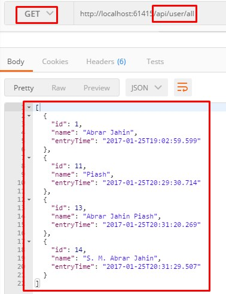
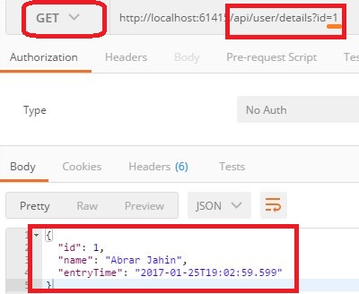
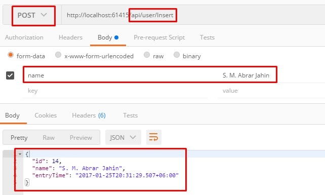
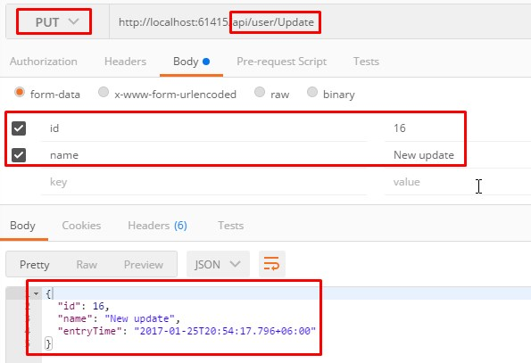
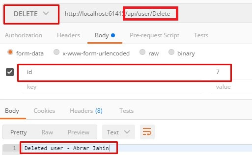

# WebAPI (REST API) - Entity Framework Core CRUD Examples:

### Get all data

    

If you need to use pagination, please create your request URL like this-

- Method - `GET`
- URL-

		/api/user/all?currentPageNo=1&pageSize=5

Default value (if u hit - `/api/user/all`)

	currentPageNo=1
	pageSize=20

### Get a specific data

    

###  Insert data

    

### Update data

    

### Delete data

    

